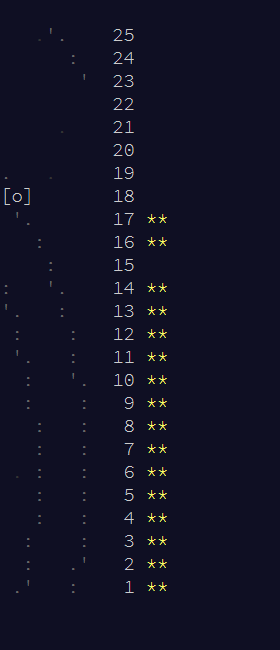

Advent of Code 2019 Solutions
---

Details:

- Primary Language: StandardML (compiled via mlton, using polyML for repl)
- Seconday Languages: Shell Scripts, Ruby

Progress:



# Build

All days except for days 1 and 2 are buildable into an executable. Those days are not executable because they either wholly or partially use shell scripts and ruby.

Build Requirements:

- Bash
- Latest Build of MLton for compilation
- Ruby

You can build all days except days 1 and 2 using:

```
make
```

You can run all solutions, which will build if necessary, using:

```
make run
```

You can clean everything using:

```
make clean
```
